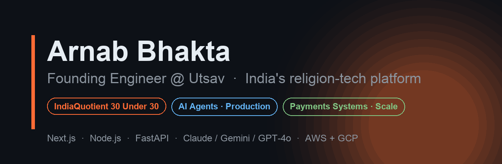

  

 

## 👋 Hey, I'm Arnab

Founding Engineer at **[Utsav](https://utsavapp.in)** — India's first subscription-led digital puja platform (10L+ devotees · 4.6 ★). I build the systems that move the numbers: the **Autopay engine** driving the majority of platform GMV, a **production multi-agent AI platform** running on Claude, Gemini, and GPT-4o, and the **Next.js 16 rebuild** that brought TBT from 14.2s → 250ms.

*Previously at Wipro (Turbo program). **IndiaQuotient 30 Under 30 (Burn 2024)**.*

---

## 🧱 Currently Building

- **AI agent orchestration platform** (FastAPI + GCP Cloud Run) — model-agnostic layer across Claude, Gemini, and GPT-4o with structured LLM tool-use
- **Recurring-payment engine** on PhonePe + Razorpay — mandate lifecycle, retries, provider failover, in-house checkout A/B testing framework
- **Customer web platform** on Next.js 16 with React Server Components — surface driving 80% of platform revenue
- **MCP (Model Context Protocol) server** with OAuth 2.0 — exposing Utsav admin tooling to external AI assistants

---

## 🎯 Selected Impact

| | |
|--|--|
| 🤖 | **Production AI agent platform** — multi-provider orchestration, multi-channel delivery (WhatsApp · Instagram · Messenger), ~98-test suite with pre-push enforcement |
| 💰 | **Autopay engine** scaling 0 → 33K+ active weekly subscribers; drives the majority of Utsav's platform GMV |
| ⚡ | **Performance rebuild** — Next.js 16 + React Server Components; Performance Score 35 → 76, TBT **14,220ms → 250ms** (57× faster) |
| 🏗️ | **5-repo monorepo contributor** — Express/TS backends, Next.js 14/16 frontends, FastAPI AI service on shared PostgreSQL (159+ models), Redis, AWS EKS + GCP Cloud Run |

---

## 🛠️ Stack I Use Daily

**Languages**

**Frontend**

**Backend**

**Databases**

**AI / LLM**

**Cloud & Infra**

---

## 📫 Connect

DMs open if you're:
- Scaling a production AI agent platform or recurring-payments infra
- Building consumer fintech in India
- Curious about the intersection of technology and tradition

---

  Ship-in-public daily. Based in Bengaluru.
   
  Most of my current work lives in private Utsav repos — see the contribution graph above for actual activity.

