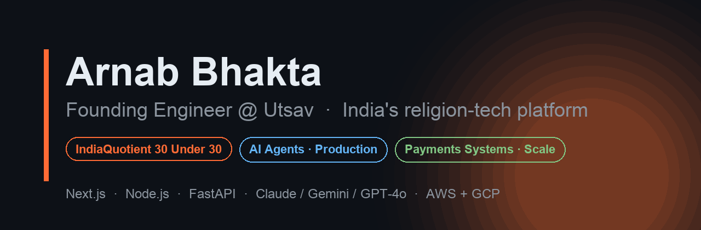

## 🧔 About Me

- 🔭 I’m currently working on [Recess](https://github.com/arnab031/Desgen)

- 🌱 I’m currently learning **Figma, PyTorch and CNN**

- 📫 Contact me **[here](arnabbhakta23@gmail.com)**

<!-- - 📄 My Resume [https://drive.google.com/file/d/10z7nWMOMKMj2KtOxszcxYI2b0sQrxFpn/view?usp=sharing](https://drive.google.com/file/d/10z7nWMOMKMj2KtOxszcxYI2b0sQrxFpn/view?usp=sharing) -->

- ⚡ Fun fact **People often call me an alien**

## ✍ My Work

Here are some of my projects on Github that I am proud of:

<!--  -->

## 📚 My Skills

## 🤝 Connect

